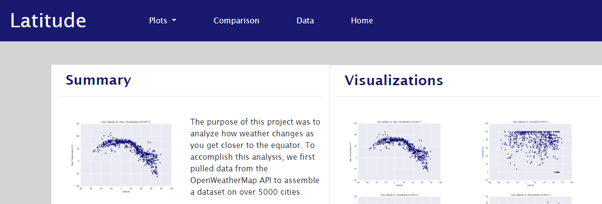

# Web Design Challenge

In this challenge we were introduced to HTML, CSS and Bootstrap. The visualizations that were used in this challenge came from a different challenge, WeatherPy. You can find the data analysis [here](https://github.com/Corters22/python-api-challenge).

### Layout

A. Home page
    This is found in the index.html in the main directory. Each visualization picture is a link to the page with a description of the chart and a conclusion of the data analysis.
    
   

B. Visualizations

   1. Latitude vs Max Temperature 
     
   
    
   2. Latitude vs Humidity 
     
   
    
   3. Latitude vs Cloudiness 
    
   
    
   4. Latitude vs Wind Speed 
    
   

C. Comparison
    This page shows all four charts next to each other to get a quick visual comparison. Each picture is also a link to its respective visualization description page.
    
   
    
D. Data
    This last page holds the table with all the city data. This is from the csv file in the Resources directory. 
    
   
